# WinWin Physical Data Model／ERD Design Review

> **狀態：DRAFT — Product Decisions Accepted; Pending Final Read-only Review**
>
> **本文件中的 table、column、key、constraint、index、schema prefix 與 Mermaid ERD 全部是 PROPOSED。它不是 Migration、不是既定 Supabase Schema，也不授權 SQL、RLS、RPC、API、資料搬移或 Remote Apply。**

## 1. Purpose and authority

本文件把已凍結的 WinWin Logical Model 轉成可比較的候選 physical persistence boundaries，並同步已接受的 Physical Model 產品決策，供 Final Read-only Review 檢查正規化、歷史、授權、concurrency、migration 及 rollback 風險。

權威來源依序為：

1. [`WINWIN_PRODUCT_DEFINITION_BOUNDARY_V1.0.md`](WINWIN_PRODUCT_DEFINITION_BOUNDARY_V1.0.md)
2. [`WINWIN_CORE_OBJECT_MODEL_PHASE_1_DESIGN_REVIEW_DRAFT.md`](WINWIN_CORE_OBJECT_MODEL_PHASE_1_DESIGN_REVIEW_DRAFT.md)
3. [`WINWIN_CORE_OBJECT_MODEL_PHASE_2_DESIGN_REVIEW_DRAFT.md`](WINWIN_CORE_OBJECT_MODEL_PHASE_2_DESIGN_REVIEW_DRAFT.md)
4. [`WINWIN_CORE_OBJECT_MODEL_PHASE_3_DESIGN_REVIEW_DRAFT.md`](WINWIN_CORE_OBJECT_MODEL_PHASE_3_DESIGN_REVIEW_DRAFT.md)
5. [`WINWIN_CORE_OBJECT_MODEL_CONSOLIDATION_REVIEW_DRAFT.md`](WINWIN_CORE_OBJECT_MODEL_CONSOLIDATION_REVIEW_DRAFT.md)
6. [`WINWIN_LOGICAL_DATA_MODEL_DESIGN_REVIEW_DRAFT.md`](WINWIN_LOGICAL_DATA_MODEL_DESIGN_REVIEW_DRAFT.md)

Frontend Prototype、Migration 007／008 僅供相容性審查。Migration 001–006、Coverage、Scenario、Backup Assignment 與 handoff 屬於「備份心」，不是 WinWin physical model 的來源。

## 2. Review boundary

本 Review 可以提出候選 table／column／key／constraint、ERD、RLS dependency 與 transaction responsibility，但不得：

- 建立或修改 Migration。
- 寫正式 SQL、RLS Policy、RPC 或 API。
- 把 Mermaid 圖當作 approved schema。
- 讓既有 Migration 的 table／enum 名稱反向凍結 WinWin 模型。
- 操作 Local／Remote Supabase、Production 或部署。

## 3. Physical model alternatives

### 3.1 A — Highly normalized one-table-per-logical-entity

每個 logical candidate 都有獨立 table，連 vocabulary 與 acting context 亦全部正規化。

**優點：** 責任邊界清楚、FK 表達力高、RLS facts 可定位。

**風險：** 過多 joins、交易面積及學生 MVP 複雜度；把純 vocabulary／snapshot 強迫成 lifecycle entity；容易把 19 candidates 誤當 19-table mandate。

### 3.2 B — Merge Membership／Relationship／Grant and content types

以少數大表同時保存參與原因、權限與內容 payload。

**優點：** 初期讀寫路徑短、table 數量較少。

**風險：** Invitation／Membership／Relationship／Grant 混合；無法安全表達 pending verification、future start 與 generation；內容表成巨大 discriminator／JSONB truth；RLS 難以維持最小權限。

### 3.3 C — Full Event Store／Event Sourcing

只保存事件，以 projection 重建所有 current state。

**優點：** 歷史與 audit 表達最完整。

**風險：** projection、replay、schema evolution、RLS 與 consistency 成本過高；MVP 不需要完整 Event Sourcing 才能保留 append-only history。

### 3.4 D — Normalized core state plus append-only version, responsibility and decision history

核心 identity／Case／access facts 正規化；published content、verification、authorization decision、Responsibility Cycle、Outcome Decision 與 audit 採追加式歷史。Current state 只從 authoritative facts 衍生或由受控 current marker 指向不可變歷史。

**優點：** 符合 Logical Model；RLS 可由有限 foundation facts 判斷；歷史完整；查詢及 transaction 複雜度仍可控制。

**風險：** 必須精確定義 current projection 與 generation uniqueness；跨表 transaction 不可由 client 任意直寫；需要防止 current snapshot 雙重真相。

### 3.5 Comparison and recommendation

| Criterion | A Highly normalized | B Merged | C Event Store | D Core + append-only history |
|---|---|---|---|---|
| Product semantics | Strong but over-modeled | Weak | Strong | **Strong and proportional** |
| Least privilege／RLS | Strong but join-heavy | Weak | Complex projection authorization | **Strong foundation facts** |
| Immutable history | Strong | Weak／mixed | Strongest | **Strong where required** |
| MVP query complexity | High | Low initially | Very high | **Moderate** |
| Concurrency integrity | Many cross-table rules | Hidden coupling | Event ordering complexity | **Explicit transaction boundaries** |
| v1／v2 non-regression | Moderate | High collision risk | Moderate | **Best coexistence boundary** |
| Rollback／bridge risk | Moderate | High | High | **Controlled** |

**Accepted（PDM-01）：D。** 採正規化核心狀態＋追加式版本、責任、授權決定與 Outcome Decision 歷史；不採完整 Event Sourcing，也不合併 Membership／Relationship／Grant。Current state 必須由 authoritative facts 推導。此接受只固定 physical design direction，不核准正式 Schema、table boundaries 或 Migration。

## 4. Candidate table set

### 4.1 Count and grouping

完整候選模型共 **26 tables**，不是 Freeze 結果，也不代表第一個 Migration 必須一次建立 26 張表：

- Identity／Case／governance：7
- Invitation／relationship／authorization：9
- Content／collaboration：9
- Cross-cutting audit：1
- Care Circle：0 authoritative tables；只作 projection

Purpose 與 Scope 第一版採小型受控 registry／reference vocabulary；Role 與 Capability 採 versioned registry。實際是否共用或拆分 physical table 留待後續 Gate。Acting Context 建議保存為每筆需追溯操作的 immutable snapshot 欄位群組，不另建可修改 current-role table。

候選實作必須分階段，每一階段另經 Design Review、isolated dry-run、RLS isolation、rollback 與 non-regression Gate：

1. Identity／Case／Governance Foundation。
2. Invitation／Membership／Relationship／Grant。
3. Content／Version／Source Reference。
4. Question／Action／Responsibility／Outcome。
5. Audit／Projection／受控 Bridge。

後續 Gate 可以合併、拆分或延後候選 table；不得把本清單當成單一 Migration backlog。

### 4.2 Candidate tables — keys, fields and lifecycle

| # | Proposed table | Logical responsibility／v1 | Candidate PK | Candidate FKs／cardinality | Required／nullable field groups | Immutable／append-only semantics |
|---|---|---|---|---|---|---|
| 1 | `winwin_actor_references` | 穩定歷史 actor attribution／v1 | `actor_ref_id` opaque UUID | 可被所有 authored／governed facts 引用 | required：actor kind、historical display label、created time；nullable：current account link hint | identity 與歷史 label 不因帳號刪除被移除 |
| 2 | `winwin_account_actor_links` | Auth account 與 stable actor 解耦／v1 | `account_actor_link_id` | actor N:1；Auth account logical reference N:1 | required：actor、account reference、generation、linked time、status；nullable：ended time／reason | 每段 link 新 row；每個 Auth user 與 actor 各最多一段 active mapping；relink 建新 generation；不以 Email、名稱或 metadata 自動連結 |
| 3 | `winwin_person_references` | Case-scoped Limited Person Reference／v1 | `person_ref_id` | Case 1:1 candidate；可被 recipient role 引用 | required：owning Case scope、display minimum、created time；nullable：受治理 account link metadata | Case-scoped identity 不可跨 Case update／merge |
| 4 | `winwin_cases` | Care Case lifecycle／v1 | `case_id` | recipient role 1:1；governance facts 0..n | required：lifecycle meaning、created actor／time；nullable：activated／closed／governance-hold times | Case identity、creator attribution 不可覆寫；current lifecycle 需受控更新 |
| 5 | `winwin_care_recipient_roles` | 每 Case 唯一被照顧者角色／v1 | `care_recipient_role_id` | Case exactly 1；Person Reference exactly 1 | required：Case、Person Reference、established time | 不可用一般 update 更換 person；錯置須治理流程 |
| 6 | `winwin_authorization_declarations` | 保存授權聲明版本／v1 | `authorization_declaration_id` | Case N:1；declarant actor N:1 | required：claim type／version、statement time、acting context；nullable：supersedes declaration | published declaration append-only |
| 7 | `winwin_authorization_decisions` | 接受、拒絕、撤回、爭議及恢復決定／v1 | `authorization_decision_id` | Declaration N:1；Case N:1；decision actor N:1 | required：decision meaning、time、reason category；nullable：prior decision reference | append-only；current authorization 由決定序列推導 |
| 8 | `winwin_invitations` | 指定接收者 invitation generation／v1 | `invitation_id` | Case N:1；inviter actor N:1；accepted membership 0..1 | required：recipient binding digest/reference、purpose、scope ceiling、expires time；nullable：service interval、terminal reason | credential generation、接受／拒絕／撤回結果保留；resend 新 row |
| 9 | `winwin_membership_generations` | Case participation generation／v1 | `membership_generation_id` | Case N:1；actor／identity N:1；Invitation 0..1 | required：generation number／identity、created time、status fact；nullable：starts／ends／termination reason | 重新加入新 row；舊 generation 不復活 |
| 10 | `winwin_relationship_generations` | 參與原因及 Family／Service generation／v1 | `relationship_generation_id` | Membership N:1 | required：relationship category、declared／established time；nullable：service purpose／period、unverified organization label | period、category、end reason 歷史不可覆寫；變更新 generation |
| 11 | `winwin_professional_identities` | 專業身分聲明／v1 | `professional_identity_id` | actor／account identity N:1 | required：professional type、declared time；nullable：declared organization text | 聲明與目前 verification 分離；不直接建立 Case access |
| 12 | `winwin_professional_verification_events` | 驗證、拒絕、失效歷史／v1 | `verification_event_id` | Professional Identity N:1；review actor 0..1 | required：decision meaning、effective time、recorded time；nullable：expiry、reason category | append-only；current verification 由事件推導 |
| 13 | `winwin_role_definitions` | 角色語意 vocabulary 版本／v1 | `role_definition_id` | Grant N:1 candidate | required：stable key、version、label、active interval | published definition immutable；不等於 permission |
| 14 | `winwin_capability_definitions` | 操作能力 vocabulary 版本／v1 | `capability_definition_id` | Grant capabilities N:1 | required：stable key、version、description、active interval | published definition immutable |
| 15 | `winwin_grant_generations` | purpose、scope ceiling、期間及 relationship path／v1 | `grant_generation_id` | Relationship N:1；Role Definition N:1；issuer actor N:1 | required：purpose controlled reference、scope ceiling controlled reference、valid-from、issued time；nullable：valid-until、revoked time／reason、superseding grant | 只有完整前置條件成立才建立；可保存 future valid-from，但 DB clock 到達前不可使用；每次變更新 generation |
| 16 | `winwin_grant_capabilities` | Grant 到 capability 的明確集合／v1 | composite candidate：Grant + Capability | Grant N:M Capability | required：grant、capability；無 optional payload | mapping 隨 Grant generation 固定，不允許跨 Grant 拼接 |
| 17 | `winwin_source_envelopes` | Care Update 共用來源與追溯外框／v1 | `source_envelope_id` | Case N:1；author actor N:1；grant path facts N:1 references | required：occurred／recorded time、purpose、scope、acting snapshot；nullable：external source label | identity／author／Case 固定；draft publish 後不可改寫 |
| 18 | `winwin_content_versions` | published content revision lineage／v1 | `content_version_id` | Envelope N:1；prior version 0..1；author actor N:1 | required：revision kind、version ordinal、body representation、published time；nullable：reason、superseded／withdrawn relation | append-only；Correction／Addendum／Withdrawal／Supersede 保留原文 |
| 19 | `winwin_observations` | Observation typed semantics／v1 | `observation_id` | Envelope N:1；current authored version relation由版本 lineage 表達 | required：observation category／subject semantics；nullable：structured minimum facts | 不保存可獨立改寫的 published text；診斷語意禁止 |
| 20 | `winwin_source_references` | 下游 pin 特定 source version／v1 | `source_reference_id` | Content Version N:1 為唯一來源端；受控 downstream target N:1 | required：source content-version FK、受控 target kind／identity、created actor／time | 來源不得以任意 kind＋id 表示；pin 不自動 retarget；第一版同 Case；失權不刪 link |
| 21 | `winwin_questions` | 直接或有來源的協作問題／v1 | `question_id` | Case N:1；author actor N:1 | required：direct／sourced marker、minimum context、purpose、scope、acting snapshot、raised time | 原問題與 direct marker 不可覆寫；Source Reference 0..n |
| 22 | `winwin_question_decisions` | resolution／reopen decision history／v1 | `question_decision_id` | Question N:1；actor N:1；Outcome Decision 0..1 candidate link | required：decision kind、acting snapshot、system-assigned Question decision order、time、reason；nullable：new source reference set relation | append-only；reopen 不覆寫舊 resolution；created-at 不作 tie breaker |
| 23 | `winwin_actions` | 具體工作／v1 | `action_id` | Case N:1；primary Question 0..1；creator actor N:1 | required：work summary、purpose、scope、created time；nullable：completion facts only through governed workflow | Action identity／purpose 不覆寫；current assignee 不在此表作 truth |
| 24 | `winwin_responsibility_cycles` | 一次指派與承接週期／v1 | `responsibility_cycle_id` | Action N:1；assigner／assignee actors N:1 | required：assigned time、status meaning；nullable：accepted／started／ended times、end reason | 每次 reassignment 新 row；舊 assignee／歷程不可覆寫 |
| 25 | `winwin_outcome_decisions` | 獨立結果決定／v1 | `outcome_decision_id` | Question N:1；confirmer actor N:1；0..n Source References | required：outcome meaning、acting snapshot、system-assigned Question decision order、confirmed time；nullable：follow-up narrative／related new Action | append-only；與 reopen 共用可比較的單調順序；current outcome 由最新有效 decision 推導 |
| 26 | `winwin_audit_events` | 高風險治理與授權事件／v1 | `audit_event_id` | actor 0..1；target 受控 polymorphic reference | required：event kind、recorded time、target type／id、sanitized context；nullable：correlation reference | append-only；不作 current access truth |

### 4.3 Candidate tables — constraints, security and operations

| Proposed table／group | Candidate unique／check semantics | Time／retention／deletion | Sensitivity | Expected queries／indexes | RLS ownership facts | Concurrency／duplicate-truth risk |
|---|---|---|---|---|---|---|
| Actor／Account links | 一段 active mapping 的邏輯唯一性；actor kind 合法 | Account unlink／delete 不刪 actor；link history retained | Identity／auth linkage | account→actor、actor history | current auth account mapping | 同 Email 新帳號不可接管舊 actor |
| Person／Recipient | Case 恰一 recipient；person ref Case-scoped | 不 hard-delete active Case recipient；爭議保全 | Direct identifier／care recipient | Case→recipient；governed account link | Case path，不因 person ref 自動授權 | Person 與 recipient profile 不得雙寫 |
| Case | lifecycle transition 合法；creator 不等於 governor | DRAFT minimization；active／historical Case retained | Case existence／governance | workspace by authorized path；status | Membership／Relationship／Grant foundation | DRAFT activation、last governor 需 transaction |
| Declarations／Decisions | ordinal／lineage 合法；決定 target 同 Case | append-only；保存期限需 expert | Legal／authorization claim | current derived decision、audit history | governance capability，非全部 content | 不另存可修改 current authorization truth |
| Invitations | credential digest unique；expiry after creation；service interval legal | expired／revoked retained；raw credential never retained | Recipient binding、purpose、period | credential lookup、recipient pending list、Case invitation history | inviter governance path／recipient binding | accept／resend／revoke 必須原子且 idempotent |
| Membership／Relationship | generation logical uniqueness；period legal；same Case alignment | expiry／termination retained；rejoin new generation | Participation／family／service relation | active path by Case＋actor＋clock | foundation authorization facts | 禁止把 relationship kind 複製回 membership truth |
| Professional identity／events | event effective interval legal；decision sequence valid | append-only；evidence retention expert | Professional evidence／decision | current verification、history | self minimum／controlled reviewers | verification update 與 path activation 不可 race |
| Role／Capability definitions | stable key＋version unique；active interval legal | immutable published vocabulary | Low alone；combined role can be sensitive | active vocabulary、version lookup | mostly server-controlled read | enum／table drift；client writes forbidden |
| Grant／capabilities | generation unique within relationship；scope／period legal | revoke／expire retained；rejoin new generation | Permission purpose／scope | complete path evaluation、active grants | central access foundation | grant＋capability creation atomic；no path stitching |
| Source／Versions／Observation | version ordinal／lineage unique；published immutable；occurred≤logical now rules require policy | DRAFT mutable；published retained／withdrawn, not deleted | Health／care content | Case timeline、latest allowed version、author history | complete Grant Path＋content scope | publish／revision atomic；current-version cache不可成 truth |
| Source References | source 必須為 Content Version FK；target／source same Case；pin exact version | retained with target history | Link can reveal hidden content | inbound／outbound lineage | both source and target visibility | downstream target 採 allow-list＋受控寫入；typed links／composite integrity 留待 SQL Gate |
| Question／Decisions | direct Question minimum context；decision sequence valid | append-only decisions；Question retained | Health／family issue | unresolved／reopened by Case、source lineage | content scope＋question capabilities | current status derived；avoid status＋decision dual truth |
| Action／Cycles | Action 0..1 primary Question；max 1 effective cycle | cycles append history；Action retained | Work／responsibility | pending／assigned／reassignment queues | action capability；governor sees minimum | assignment／accept／expiry transitions need locking |
| Outcome／Reopen Decisions | 每 Question 單調 system decision order；source visibility at write time | append-only；old decisions retained | Result／referral advice | current derived outcome、history | outcome／reopen capability＋source visibility | 受控 transaction 配號；created-at 不作 tie breaker；no current column truth |
| Audit Events | event kind／target type allow-list | append-only；retention expert | Security／governance metadata | target timeline、correlation, security review | restricted support／governance | target polymorphism can orphan; transaction emits event |
| Care Circle projection | no independent constraint／write | expires immediately with source facts | Member／relationship visibility | viewer-specific active Circle | derived from authorized facts | persistence／cache must not become authoritative |

### 4.4 Per-table security, query and integrity review

| Proposed table | Candidate unique／check | Deletion／retention | Sensitivity＋query／index need | RLS facts | Concurrency／double-truth risk |
|---|---|---|---|---|---|
| `winwin_actor_references` | stable opaque identity；actor kind allow-list | never cascade from account；retain attribution | identity metadata；lookup by actor | normally reached through account link／Case path | current display profile must not overwrite historical label |
| `winwin_account_actor_links` | max one active mapping per account and per actor；generation／legal interval | close link, do not delete actor | Auth linkage；account→actor and actor history | self account mapping／restricted operator | Auth delete trigger race；new account takeover；automatic relink forbidden |
| `winwin_person_references` | one Case scope per reference；no natural-key unique | minimize abandoned draft; retain governed trace | direct identifiers；Case-scoped lookup | no access merely from person reference | duplicated recipient profile／cross-Case merge |
| `winwin_cases` | lifecycle allow-list；created time stable | DRAFT minimization; active/history retained | Case existence；authorized workspace indexes | complete Case path／governance facts | activation and last-governor race |
| `winwin_care_recipient_roles` | unique Case；person and Case scope agree | no ordinary delete／replacement | recipient identity；Case lookup | inherits authorized Case visibility | person reference and role could diverge |
| `winwin_authorization_declarations` | claim version／lineage unique per declaration family | append-only; retention expert | legal claim；Case current/history query | governance minimum, not content visibility | declaration current marker as second truth |
| `winwin_authorization_decisions` | decision ordering／kind valid | append-only | dispute／authorization outcome；latest/history | restricted governance | concurrent contradictory decisions need ordering transaction |
| `winwin_invitations` | credential digest unique；expiry／interval checks；one accepted result | retain terminal rows; never raw credential | recipient/purpose；credential and pending indexes | inviter governance＋recipient binding | accept vs revoke／resend race |
| `winwin_membership_generations` | generation unique per Case＋actor context；period legal | terminate, never reactivate or overwrite | participation；active path indexes | foundation fact | duplicate active generation／relationship copied here |
| `winwin_relationship_generations` | parent Case alignment；category／period checks | expire／revoke retained; rejoin new row | family/service reason；active relationship indexes | foundation fact＋viewer minimum | service state copied into membership or Grant |
| `winwin_professional_identities` | identity generation／professional type valid | retain declaration; no cascade from account | profession declaration；actor lookup | self minimum／reviewer | current verification duplicated here |
| `winwin_professional_verification_events` | decision sequence／effective interval valid | append-only; evidence retention expert | verification result；latest/history | self-safe status／restricted reviewer | verify/revoke race with Grant activation |
| `winwin_role_definitions` | stable key＋version unique | immutable published rows; retire by interval | low sensitivity；active/version lookup | server-controlled read | template name mistaken for permission truth |
| `winwin_capability_definitions` | stable key＋version unique | immutable published rows | low sensitivity；active/version lookup | server-controlled read | application vocabulary drift |
| `winwin_grant_generations` | generation and interval checks；relationship alignment | revoke／expire retained; no reactivation | high-value authorization facts；path indexes | central authorization fact | overlapping grants／mutable current grant snapshot |
| `winwin_grant_capabilities` | unique Grant＋Capability pair | fixed with generation; no partial client delete | permission detail；grant lookup | central authorization fact | capability stitching across grants |
| `winwin_source_envelopes` | Case／author fixed; dual-time checks | draft can minimize; published retained | health metadata；timeline／author indexes | full path＋content scope | envelope metadata duplicated in typed content |
| `winwin_content_versions` | Envelope＋ordinal unique；valid acyclic lineage candidate | append-only; withdrawal not delete | health content；version lineage indexes | source visibility＋scope | publish races／mutable current body cache |
| `winwin_observations` | Envelope alignment；observation category valid | retain through version lineage | health observation；Case／category queries | source visibility | published prose duplicated outside version table |
| `winwin_source_references` | Content Version FK pin；downstream target allow-list；same-Case rule | retain with downstream history | link existence sensitive；inbound/outbound indexes | both source and target authorization | downstream target orphan／scope laundering；source itself不可 polymorphic |
| `winwin_questions` | direct question minimum-context check；Case fixed | retain; decisions append | health/family issue；open/current indexes | question capability＋scope | mutable resolved status vs decisions |
| `winwin_question_decisions` | Question decision order unique candidate；resolution／reopen kinds | append-only | decision reasons；Question timeline | reopen capability＋source visibility | controlled order allocation／locking |
| `winwin_actions` | 0..1 primary Question；Case alignment | retain work history | task/source context；pending/action indexes | action capability＋scope | storing current assignee here duplicates cycle |
| `winwin_responsibility_cycles` | max one effective cycle per Action candidate；interval order | append-only cycles | responsibility and refusal reason；Action/current indexes | assignee self＋minimum governor | assign/reassign/expiry race |
| `winwin_outcome_decisions` | Question alignment；shared monotonic decision ordering | append-only | result/referral advice；Question latest/history | outcome capability＋visible sources | controlled order allocation；mutable current Outcome duplicate |
| `winwin_audit_events` | event／target allow-list；correlation format | append-only; retention expert | security metadata；target/time/correlation indexes | highly restricted | orphan polymorphic target／event omission in failed transaction |

### 4.5 Logical concept coverage

| Frozen logical concept | Proposed physical treatment | Coverage status |
|---|---|---|
| Limited Person Reference | `winwin_person_references` | Covered; Case-scoped only |
| Account Identity | `winwin_actor_references`＋`winwin_account_actor_links` | Covered; Auth decoupled |
| Care Case | `winwin_cases` | Covered |
| Care Recipient Role | `winwin_care_recipient_roles` | Covered; unique Case candidate |
| Authorization／Declaration | declarations＋decisions | Covered; claim and outcome separated |
| Invitation | `winwin_invitations` | Covered |
| Membership Generation | `winwin_membership_generations` | Covered |
| Relationship Generation | `winwin_relationship_generations` | Covered |
| Family Relationship | relationship category／typed field group | Covered as embedded subtype |
| Service Relationship | relationship category＋purpose／period field group | Covered as embedded subtype |
| Professional Identity／Verification | professional identities＋verification events | Covered; facts separated |
| Role／Capability | versioned role＋capability registries | Covered；accepted registry direction，exact code list Deferred |
| Grant Generation | grants＋grant capabilities | Covered |
| Acting Context | immutable snapshot field group on traceable operations | Covered without current-role table |
| Care Update／Source Envelope | `winwin_source_envelopes` | Covered |
| Content Version／Revision | `winwin_content_versions` | Covered |
| Source Reference | `winwin_source_references` | Covered；source pins Content Version FK，downstream target enforcement Deferred |
| Observation | `winwin_observations`＋published version | Covered as typed semantics |
| Question | `winwin_questions` | Covered |
| Action | `winwin_actions` | Covered |
| Responsibility Cycle | `winwin_responsibility_cycles` | Covered |
| Outcome Decision | `winwin_outcome_decisions` | Covered |
| Audit Event | `winwin_audit_events` | Covered；controlled polymorphic target accepted，writer security Deferred |
| Care Circle projection | no authoritative table; derived projection | Covered without second truth |

## 5. Sixteen structural decisions

### 5.1 Auth account vs stable actor

**Options：** direct Auth FK everywhere；stable actor only；stable actor＋historical account-link generations.

**Accepted（PDM-02）：stable actor＋account-link generation history。** Auth deletion must not remove authorship，且不得 cascade 歷史。每個 Auth user 最多一段 active actor mapping，每個 actor 亦最多一段 active Auth mapping；relink 建立新 generation。Email、名稱或 metadata 不得自動建立連結。Direct Auth reference 只存在 mapping facts，不能成為內容生命週期根。Auth schema dependency 與 deletion trigger behavior 留待技術審查。

### 5.2 Limited Person Reference vs Care Recipient Role

**Accepted（PDM-03）：separate physical candidates。** Person Reference carries the minimal Case-scoped person pointer；Recipient Role expresses exactly one effective recipient role per Case。沒有跨 Case 唯一性，Person Reference 不建立 Account 或 access。合併會令治理式帳號連結或 recipient-role 爭議覆寫 person truth。

### 5.3 Authorization declaration vs decision history

**Accepted（PDM-04）：separate。** Declaration 保存版本化聲明；Decision 追加保存接受、拒絕、撤回、爭議或恢復結果。Current authorization 由最新有效決定推導。新申請或恢復建立新的 declaration／decision history，不得把舊聲明直接改回有效。法律證據與保存期限仍需專家確認。

### 5.4 Membership／Relationship／Grant FK direction

**Accepted：Membership → Relationship → Grant。** Each child references exactly one parent generation；reverse current IDs are not stored as independent truth。Current path is derived by status／period／verification conditions。

### 5.5 Pending verification／future start

**Accepted（PDM-05）：** 接受邀請先建立 Membership Generation；Relationship Generation 可 pending 或 future-start。在驗證、授權、治理與其他必要條件完整前，不建立可用 Grant。條件完整時才由受控 activation 建立 Grant Generation；future-start Grant 可保存未來 `valid_from`，但 database clock 到達前不可使用。Membership、Relationship、Grant 或必要條件任一失效，完整路徑即失效，不要求背景排程先更新 row。Clock helper 與 transaction 實作 Deferred。

### 5.6 Role／Capability／Purpose／Scope representation

| Choice | Benefit | Risk | Recommendation |
|---|---|---|---|
| Database enum | Strong validation | hard migration／retirement; existing enum lock-in | Avoid for evolving role／capability |
| Controlled text + checks | Simple | application／DB drift | 不作預設 authoritative vocabulary |
| Versioned registry tables | explainable, retireable, auditable | extra joins | Accepted for Role／Capability；Purpose／Scope 採小型受控 registry／reference vocabulary |

**Accepted（PDM-06）：** Role／Capability 使用 versioned registry；Purpose／Scope 使用小型受控 registry／reference vocabulary；Family Relationship 使用小型聲明式 vocabulary。預設不採 PostgreSQL enum。Machine code 語意 immutable，語意改變須建立新 code／version；inactive vocabulary 不刪除，display label 與 code 分離。實際 code list 於 Migration 前另行審查。

### 5.7 Care Update representation

**Options：** envelope＋typed tables；single discriminator table；JSONB payload.

**Accepted（PDM-07）：common envelope＋immutable Content Version lineage＋typed semantic tables。** Envelope holds author／time／scope／acting lineage；Observation、Question、Action 保持 domain-specific structure。禁止 giant JSONB truth、重複 common fields 與 published version direct UPDATE。Limited JSONB 只可作 non-authoritative extension metadata，仍需後續審查。

### 5.8 Content revision lineage

Use an immutable version row per publication with explicit prior／superseded relation and revision kind. Do not update published body or silently point all downstream references to “latest.” A controlled current projection may select a version but cannot replace lineage truth.

### 5.9 Source Reference safety

**Accepted（PDM-08）：** source side 必須以 FK pin 一個明確 Content Version，不得用任意 `source_kind＋source_id` 指向內容來源。Controlled write 驗證同一 Case、downstream target、source visibility 與 scope non-expansion；第一版拒絕 cross-Case。Downstream target 可使用受控 allow-list＋target identity 或後續拆成 typed links，但不得把 source pointer 變成 polymorphic。Composite FK 與 transaction 細節 Deferred。

### 5.10 Question／Action cardinality

Action holds nullable primary Question reference; Question has no stored Action array. Indexing Action by primary Question yields `Question 0..n Actions` and `Action 0..1 primary Question`. Independent Actions use null primary Question and retain Case context.

### 5.11 One effective Responsibility Cycle

Cycles retain all history. A candidate partial uniqueness rule over “current” rows may help, but clock-based expiry and transaction races mean assignment／reassignment must also lock the Action responsibility boundary. Exact implementation Deferred.

### 5.12 Current Outcome

**Accepted（PDM-11）：** 不設 mutable current-outcome column。Outcome 與 reopen decisions 在每個 Question 內使用由系統受控 transaction 配發、可互相比較的單調 decision order；使用者輸入日期與 `created_at` 不得作 tie breaker。若最新有效 decision 是 reopen，Question 不視為 resolved。Current Outcome 由最新有效 decision order 推導；sequence、locking 與 concurrency 實作 Deferred。若日後需要 cache，只能是可重建 projection，不是真相。

### 5.13 Question reopen history

Question Decisions append resolution／reopen facts and may link to the corresponding Outcome Decision. Reopen never deletes prior decisions or reopens completed Actions. Current Question meaning derives from ordered decisions.

### 5.14 Audit target integrity

**Options：** many nullable FKs；typed audit tables；controlled polymorphic target.

**Accepted（PDM-09）：controlled polymorphic audit target written only by trusted internal transactions。** Target kind 與 event kind 採 allow-list；writer 驗證 target 存在、同 Case 且組合合法。Client 不得直接 insert／update／delete。Audit append-only；target tombstone 保留最低識別。此設計不宣稱具有 native FK；helper、ACL 與可能的 SECURITY DEFINER 必須另經安全審查。

### 5.15 DRAFT abandonment tombstone

**Accepted（PDM-12）：** 合法放棄 DRAFT 時，移除／最小化姓名、健康內容與完整草稿 payload，只保留 opaque internal reference、creator actor、created／abandoned times、reason category 與 operation／audit reference。Tombstone 不可搜尋、不可出現在 workspace、不可存取或恢復。保存政策可配置，不在本文件寫死天數；Production retention／erasure 仍需法律／隱私確認，但不阻擋結構審查。

### 5.16 Duplicate Case marker

Do not store the other Case ID in user-visible Case rows. If implemented, use a restricted governance review record with opaque candidate references, access-controlled reason and no automatic merge effect. Unprivileged search／counts must not reveal the other Case. First-version implementation may be Deferred entirely.

## 6. PROPOSED Mermaid ERD

> **PROPOSED ONLY — not a Migration, not an approved Supabase Schema, and not approval of table／column names. Care Circle is intentionally absent as an authoritative table.**

```mermaid
erDiagram
    WINWIN_ACTOR_REFERENCES ||--o{ WINWIN_ACCOUNT_ACTOR_LINKS : has_history
    WINWIN_ACTOR_REFERENCES ||--o{ WINWIN_CASES : creates
    WINWIN_ACTOR_REFERENCES ||--o{ WINWIN_AUTHORIZATION_DECLARATIONS : declares
    WINWIN_ACTOR_REFERENCES ||--o{ WINWIN_INVITATIONS : invites
    WINWIN_ACTOR_REFERENCES ||--o{ WINWIN_MEMBERSHIP_GENERATIONS : participates
    WINWIN_CASES ||--|| WINWIN_PERSON_REFERENCES : scopes
    WINWIN_CASES ||--|| WINWIN_CARE_RECIPIENT_ROLES : has_one
    WINWIN_PERSON_REFERENCES ||--|| WINWIN_CARE_RECIPIENT_ROLES : fills

    WINWIN_CASES ||--o{ WINWIN_AUTHORIZATION_DECLARATIONS : governs
    WINWIN_AUTHORIZATION_DECLARATIONS ||--o{ WINWIN_AUTHORIZATION_DECISIONS : receives
    WINWIN_CASES ||--o{ WINWIN_INVITATIONS : offers
    WINWIN_INVITATIONS o|--o| WINWIN_MEMBERSHIP_GENERATIONS : may_create
    WINWIN_CASES ||--o{ WINWIN_MEMBERSHIP_GENERATIONS : contains
    WINWIN_MEMBERSHIP_GENERATIONS ||--|{ WINWIN_RELATIONSHIP_GENERATIONS : explains
    WINWIN_RELATIONSHIP_GENERATIONS ||--o{ WINWIN_GRANT_GENERATIONS : bounds
    WINWIN_ROLE_DEFINITIONS ||--o{ WINWIN_GRANT_GENERATIONS : types
    WINWIN_GRANT_GENERATIONS ||--|{ WINWIN_GRANT_CAPABILITIES : includes
    WINWIN_CAPABILITY_DEFINITIONS ||--o{ WINWIN_GRANT_CAPABILITIES : defines

    WINWIN_ACTOR_REFERENCES ||--o{ WINWIN_PROFESSIONAL_IDENTITIES : declares
    WINWIN_PROFESSIONAL_IDENTITIES ||--o{ WINWIN_PROFESSIONAL_VERIFICATION_EVENTS : receives

    WINWIN_CASES ||--o{ WINWIN_SOURCE_ENVELOPES : owns
    WINWIN_ACTOR_REFERENCES ||--o{ WINWIN_SOURCE_ENVELOPES : authors
    WINWIN_SOURCE_ENVELOPES ||--|{ WINWIN_CONTENT_VERSIONS : versions
    WINWIN_SOURCE_ENVELOPES ||--o{ WINWIN_OBSERVATIONS : types
    WINWIN_CONTENT_VERSIONS ||--o{ WINWIN_SOURCE_REFERENCES : pinned_by

    WINWIN_CASES ||--o{ WINWIN_QUESTIONS : asks
    WINWIN_ACTOR_REFERENCES ||--o{ WINWIN_QUESTIONS : raises
    WINWIN_QUESTIONS ||--o{ WINWIN_QUESTION_DECISIONS : changes_by
    WINWIN_QUESTIONS o|--o{ WINWIN_ACTIONS : primary_for
    WINWIN_ACTIONS ||--o{ WINWIN_RESPONSIBILITY_CYCLES : assigned_by
    WINWIN_ACTOR_REFERENCES ||--o{ WINWIN_RESPONSIBILITY_CYCLES : accepts
    WINWIN_QUESTIONS ||--o{ WINWIN_OUTCOME_DECISIONS : decided_by
    WINWIN_ACTOR_REFERENCES ||--o{ WINWIN_OUTCOME_DECISIONS : confirms

    WINWIN_ACTOR_REFERENCES ||--o{ WINWIN_AUDIT_EVENTS : acts

    WINWIN_ACTOR_REFERENCES {
        uuid actor_ref_id PK
        text actor_kind
        text historical_label
    }
    WINWIN_ACCOUNT_ACTOR_LINKS {
        uuid account_actor_link_id PK
        uuid actor_ref_id FK
        uuid auth_account_ref
        int generation
        timestamptz linked_at
        timestamptz ended_at
    }
    WINWIN_PERSON_REFERENCES {
        uuid person_ref_id PK
        uuid case_scope_id FK
        text display_minimum
    }
    WINWIN_CASES {
        uuid case_id PK
        uuid created_by_actor_ref_id FK
        text lifecycle_meaning
        timestamptz created_at
    }
    WINWIN_CARE_RECIPIENT_ROLES {
        uuid care_recipient_role_id PK
        uuid case_id FK
        uuid person_ref_id FK
    }
    WINWIN_AUTHORIZATION_DECLARATIONS {
        uuid authorization_declaration_id PK
        uuid case_id FK
        uuid declarant_actor_ref_id FK
        text claim_version
    }
    WINWIN_AUTHORIZATION_DECISIONS {
        uuid authorization_decision_id PK
        uuid authorization_declaration_id FK
        text decision_meaning
        timestamptz decided_at
    }
    WINWIN_INVITATIONS {
        uuid invitation_id PK
        uuid case_id FK
        uuid inviter_actor_ref_id FK
        text recipient_binding_digest
        timestamptz expires_at
    }
    WINWIN_MEMBERSHIP_GENERATIONS {
        uuid membership_generation_id PK
        uuid case_id FK
        uuid actor_ref_id FK
        uuid source_invitation_id FK
        text lifecycle_meaning
    }
    WINWIN_RELATIONSHIP_GENERATIONS {
        uuid relationship_generation_id PK
        uuid membership_generation_id FK
        text relationship_category
        timestamptz starts_at
        timestamptz ends_at
    }
    WINWIN_PROFESSIONAL_IDENTITIES {
        uuid professional_identity_id PK
        uuid actor_ref_id FK
        text professional_type
    }
    WINWIN_PROFESSIONAL_VERIFICATION_EVENTS {
        uuid verification_event_id PK
        uuid professional_identity_id FK
        text decision_meaning
        timestamptz effective_at
    }
    WINWIN_ROLE_DEFINITIONS {
        uuid role_definition_id PK
        text stable_key
        int version
    }
    WINWIN_CAPABILITY_DEFINITIONS {
        uuid capability_definition_id PK
        text stable_key
        int version
    }
    WINWIN_GRANT_GENERATIONS {
        uuid grant_generation_id PK
        uuid relationship_generation_id FK
        uuid role_definition_id FK
        text purpose_value
        text scope_ceiling
        timestamptz starts_at
        timestamptz ends_at
    }
    WINWIN_GRANT_CAPABILITIES {
        uuid grant_generation_id FK
        uuid capability_definition_id FK
    }
    WINWIN_SOURCE_ENVELOPES {
        uuid source_envelope_id PK
        uuid case_id FK
        uuid author_actor_ref_id FK
        timestamptz occurred_at
        timestamptz recorded_at
        text sharing_scope
    }
    WINWIN_CONTENT_VERSIONS {
        uuid content_version_id PK
        uuid source_envelope_id FK
        uuid prior_version_id FK
        text revision_kind
        timestamptz published_at
    }
    WINWIN_OBSERVATIONS {
        uuid observation_id PK
        uuid source_envelope_id FK
        text observation_category
    }
    WINWIN_SOURCE_REFERENCES {
        uuid source_reference_id PK
        uuid content_version_id FK
        text target_kind
        uuid target_ref
    }
    WINWIN_QUESTIONS {
        uuid question_id PK
        uuid case_id FK
        uuid author_actor_ref_id FK
        text origin_kind
        text minimum_context
    }
    WINWIN_QUESTION_DECISIONS {
        uuid question_decision_id PK
        uuid question_id FK
        bigint question_decision_order
        text decision_kind
        timestamptz decided_at
    }
    WINWIN_ACTIONS {
        uuid action_id PK
        uuid case_id FK
        uuid primary_question_id FK
        text work_summary
    }
    WINWIN_RESPONSIBILITY_CYCLES {
        uuid responsibility_cycle_id PK
        uuid action_id FK
        uuid assignee_actor_ref_id FK
        text lifecycle_meaning
    }
    WINWIN_OUTCOME_DECISIONS {
        uuid outcome_decision_id PK
        uuid question_id FK
        uuid confirmer_actor_ref_id FK
        bigint question_decision_order
        text outcome_meaning
        timestamptz confirmed_at
    }
    WINWIN_AUDIT_EVENTS {
        uuid audit_event_id PK
        uuid actor_ref_id FK
        text target_kind
        uuid target_ref
        text event_kind
        timestamptz recorded_at
    }
```

## 7. Constraint／transaction enforcement matrix

| Rule | Single-table constraint | Cross-table transaction | DB clock | RLS／auth helper | App workflow | Legal／field |
|---|---|---|---|---|---|---|
| Single Care Recipient Role | Candidate unique Case reference | Case＋recipient creation should be atomic | No | Read path uses Case authorization | DRAFT creation flow | Identity dispute expert |
| Last governor protection | Not sufficient | **Required** membership／grant transfer check | Maybe for expiry | Governance helper separated from content | Successor acceptance | Recovery eligibility expert |
| Effective generation uniqueness | Partial unique candidates | **Required** when replacing generations | **Required** for periods | Complete-path helper | Controlled lifecycle UI | No |
| Legal date intervals | **Required checks** | Cross-entity interval compatibility | **Required** | Helper rejects expired path | Date entry validation | Service semantics expert |
| Invitation acceptance atomicity | Token／result uniqueness partial | **Required** bind recipient＋consume invite＋create pending facts | **Required** expiry | Trusted recipient／inviter path | Confirm preview／accept | No |
| Expiry／revocation access loss | Status／timestamps stored | Revocation event＋dependent closure may be atomic | **Required** | **Required** on every access | Generalized denial UI | No |
| One effective Responsibility Cycle | Partial uniqueness candidate | **Required** Action-boundary lock | Required if cycle expires by time | Assignee／governor helper | Assignment UI | No |
| Append-only revisions | Update／delete prevention candidate | Publish revision＋lineage＋audit atomic | Recorded time | Source write capability | Correction UX | Retention expert |
| Source version pinning | Content Version FK candidate；source 不 polymorphic | Target＋source same-Case／scope validation | Access time | **Required** source and target visibility | Manual update adoption | No |
| Current Outcome derived | No current column；Question decision order unique candidate | 受控配號＋decision append＋audit atomic | created-at 不作 tie breaker | Outcome／reopen capability＋source visibility | Explicit confirm／reopen | Outcome authority expert |
| Account deletion attribution | Actor reference non-null | unlink account＋retain actor atomic | No | Deleted account cannot authenticate | deletion warning／governance handoff | Retention expert |
| DRAFT abandonment | Lifecycle checks partial | **Required** validate no collaboration＋minimize payload＋tombstone | abandonment time | creator／governance helper | explicit irreversible warning | Retention／erasure expert |

## 8. RLS dependency planning（no policies）

### 8.1 Foundation authorization facts

Candidate foundation facts:

1. current Auth account → stable actor link;
2. Case lifecycle and governance hold;
3. Membership generation;
4. Relationship generation and service interval;
5. Professional verification condition where required;
6. Grant generation, purpose, scope ceiling and capabilities;
7. content-specific sharing scope;
8. target Case consistency.

Care Circle、Audit Event、UI role label and historical participation are not access facts.

### 8.2 Helper boundaries and recursion risk

- Future authorization helpers may need privileged execution to inspect foundation facts without recursive policies, but SECURITY DEFINER is only a candidate and must receive separate security review, fixed search path, schema qualification, minimal grants and adversarial tests.
- Helpers should return narrow authorization decisions, not sensitive rows or hidden counts.
- Foundation tables should avoid policies that recursively query content tables.
- Content visibility must consume foundation authorization facts; it must not make Membership access depend on querying protected content.
- FORCE RLS does not constrain a role with BYPASSRLS or a qualifying owner context; operator and service-role boundaries remain separate controls.

### 8.3 Client direct writes to prohibit

Candidate server-controlled operations:

- Invitation accept／resend／revoke.
- DRAFT activation／abandonment and authorization decisions.
- Membership／Relationship／Grant generation creation, revocation and transfer.
- Professional verification events.
- Assignment／reassignment／acceptance／completion transitions.
- Published revision／withdrawal／supersede.
- Outcome Decision／Question reopen.
- Audit Event emission.

Audit Event 只能由受控 internal writer 寫入；writer 必須驗證 allow-listed event／target combination、target 存在及同 Case。Client 對 audit table 的 direct insert／update／delete 一律禁止。

These operations likely require controlled transaction／RPC in a later Gate; this document does not design them.

### 8.4 Governance vs content

Governance helpers may expose only minimal actor／relationship／expiry／reassignment facts. Content helpers separately require content scope and purpose. A governor may revoke or reassign without reading professional or family-limited source text.

## 9. Migration 007／008 compatibility

### 9.1 Classification

| Existing asset | Byte-level reuse | Concept reuse | Incompatible／do not extend | Treatment |
|---|---|---|---|---|
| Migration 007 actor references | Not yet proven | Stable attribution pattern | actor/account/person semantics may differ | Preserve history; map only after semantic proof |
| Migration 007 Case／declaration | Not yet proven | DRAFT／governance foundation patterns | recipient role and decision history incomplete | Concept reuse, rewrite candidate |
| Migration 007 Invitation | Not yet proven | bound credential／expiry concepts | acceptance coupling may create access too early | Concept reuse, controlled new implementation |
| Migration 007 Membership／Grant | No | generation／period／scope concepts | Relationship mixed into Membership; no clean pending path | Preserve but do not expand as WinWin authoritative truth |
| Migration 007 access events | Not yet proven | Audit vocabulary pattern | target model may not fit new entities | Concept reuse after target-integrity decision |
| Migration 008 identities／verification | Not yet proven | verification separation | Person／Account mapping and evidence lifecycle need review | Concept reuse, rewrite candidate |
| Migration 008 role／capability templates | No automatic reuse | vocabulary versioning concept | enum／template values not frozen Physical Model | Preserve history; do not let vocabulary lock in |
| Migration 001–006 | No | None for WinWin core | 備份心 semantics | Historical／v1 regression only |

No Migration 007／008 object is approved for byte-level reuse in this Gate. Byte-level reuse requires exact semantic, RLS, dependency and rollback proof later.

### 9.2 Authoritative side and bridge direction

- New WinWin physical model is the future authoritative side for WinWin features.
- Preferred bridge is one-way read／migration from explicitly mapped legacy v2 facts into the new model, never bidirectional dual write.
- Existing v2 rows, if any, remain under existing semantics until a separately authorized migration maps them.
- Unmapped rows fail closed and remain historical; they must not silently receive new access.

### 9.3 Namespace／ordering candidates

**Accepted（PDM-10）：** 第一版 client-facing objects 採 `public.winwin_*` namespace，避免含糊的 `v2_*`。`public` 不代表自動 exposed 或可直接寫入；RLS、ACL 與 direct-write prohibition 仍須逐項審查。私有 helper 可候選放入非 exposed private schema；是否改採 custom exposed schema 留待後續。此命名決策不核准任何正式 table／column name。

Future ordering would conceptually be:

1. preserve v1 and existing v2;
2. create isolated WinWin foundation;
3. verify empty-state security;
4. introduce controlled bridge／backfill only if needed;
5. verify source-to-target counts and semantics without enabling access;
6. switch application authority only under an explicit cutover Gate.

Rollback must disable bridge／cutover without deleting historical source rows. Backfill must be idempotent, versioned and fail closed on ambiguity.

## 10. Twelve physical walkthroughs

| Scenario | Candidate writes | Atomic boundary | Immutable history | Must reject | Still unresolved |
|---|---|---|---|---|---|
| Create DRAFT Case | Actor, Case, Person Ref, Recipient Role, Declaration | Case＋Person＋Recipient minimum creation | creator／declaration | Invitation／formal content before activation | physical schema／DRAFT status names |
| Authorization activation＋first governor | Authorization Decision, Membership／Relationship／Grant generations, Audit | decision＋first complete governance path | declaration／decision／issuer | activation without accepted decision／complete path | last-governor transaction details |
| Family joins | Invitation, Membership, Family Relationship, Grant, Audit | consume invitation＋create pending／active facts | invitation generations／relationship | wrong account, credential replay, all-content default | Family vocabulary Freeze |
| Professional waits then activates | Invitation, Membership, Service Relationship, Verification Event, later Grant | accept pending separately；完整條件後建立 Grant；future valid-from 由 DB clock 控制可用性 | verification／service periods／Grant generation | content before all conditions valid；future start 前 access | exact activation／clock helper transaction |
| Service expiry | Relationship／Grant end facts, Cycle end if assignee, Audit | expiry evaluation＋governed closure where written | generations／old cycle | future read／write／hidden counts | clock and scheduled cleanup distinction |
| Skin observation chain | Source Envelope, Content Version, Observation, References, Question, Actions, Cycles, Outcome Decision | publish; assign; outcome each separate controlled transactions | every published version／cycle／decision | diagnosis claim／scope expansion／auto resolution | typed observation fields |
| Observation correction | new Content Version, optional new Source References, Audit | publish revision＋lineage | original and correction | update published body／auto retarget downstream | revision relation physical checks |
| Question reopen | Question Decision, optional new References／Action／Cycle | reopen decision＋audit; new work separately | old outcome／completed actions | overwrite resolution／restart old action | formal state projection |
| Action reassignment | close old Cycle, create new Cycle, Audit | one Action-boundary transaction | old assignee／end reason | overlap two current cycles／assign unauthorized actor | locking strategy |
| Outcome Decision | Outcome Decision, References, Question Decision candidate | 每 Question 受控 decision-order allocation＋source visibility＋audit | all prior outcomes／reopen decisions | auto create from completion／mutable current outcome／created-at tie break | sequence／locking implementation |
| Account deletion | end Account link, governance transfer where required, Audit | prevent last-governor orphan; unlink auth | actor attribution everywhere | cascade content／new account takeover | Auth trigger integration |
| DRAFT abandonment | minimize Person／draft payload, lifecycle／tombstone, Audit | validate no collaboration＋minimize＋close | opaque ref、creator、timestamps、reason、operation／audit ref | abandon active／invited／shared Case；search／workspace／recovery | legal retention and erasure timing |

## 11. Deferred tables／features

- Attachments and Storage tables are excluded from first version.
- Organization／institution directory, staff assignment and organization-wide Case workspace.
- Cross-Case Person master／resolution／automatic deduplication.
- Case merge／split／cross-case transfer tables.
- Chat、notification delivery、calendar、AI、GPS、monitoring.
- Full Event Store／event replay infrastructure.
- Care Circle authoritative table.
- Disposable caches／materialized projections until query evidence requires them.

## 12. Remaining expert and technical dependencies

PDM-01 through PDM-12 have product dispositions. No stale Physical Model product blocker remains. The following dependencies do not block Final Read-only Physical Model Review, but they still block the affected Production policy or implementation:

- Legal／privacy retention for DRAFT tombstones、authorization disputes、verification evidence、audit and account deletion.
- Field／legal confirmation of Family vocabulary、professional evidence and Outcome authority.
- Exact Role／Capability／Purpose／Scope／Family code lists before Migration.
- Auth lifecycle mapping／unlink integration and account recovery threat review.
- Database-clock helper、transaction、sequence、locking and concurrency design.
- Source-reference downstream target integrity implementation and Audit controlled-writer security review.
- RLS／ACL、private helper schema and client direct-write review.
- Per-stage bridge、rollback、dry-run and non-regression evidence.

The first two items require legal／field experts. The remaining items are deferred technical design Gates; none is silently treated as solved.

## 13. Physical Model Product Decision Log

| ID | Disposition | Accepted decision | Still Deferred／Expert dependency |
|---|---|---|---|
| PDM-01 | **Accepted** | Option D：normalized core＋append-only version／responsibility／authorization／Outcome histories；no full Event Sourcing | formal Schema／table boundary／Migration |
| PDM-02 | **Accepted with constraints** | stable actor＋bidirectionally unique active Auth mapping generations；no cascade or automatic relink | Auth integration／deletion trigger security |
| PDM-03 | **Accepted** | Case-scoped Person Ref and one effective Recipient Role remain separate | exact uniqueness／governed relink transaction |
| PDM-04 | **Accepted with constraints** | versioned Declarations＋append-only Decisions；current authorization derived | legal evidence／retention |
| PDM-05 | **Accepted with constraints** | Grant only after complete prerequisites；future valid-from unusable before DB clock | activation helper／clock／transaction |
| PDM-06 | **Accepted with constraints** | versioned Role／Capability registries；small controlled Purpose／Scope／Family vocabularies；no enum default | exact code lists／physical registry split／field review |
| PDM-07 | **Accepted** | Source Envelope＋immutable Content Version＋typed semantic tables | exact typed fields／physical split |
| PDM-08 | **Accepted with constraints** | source always pins Content Version FK；same Case；downstream target controlled | typed-link vs allow-list implementation／composite integrity |
| PDM-09 | **Accepted with constraints** | append-only controlled polymorphic Audit target via internal validated writer | writer helper／ACL／SECURITY DEFINER security review |
| PDM-10 | **Accepted with constraints** | client-facing `public.winwin_*`；private helper schema candidate；public is not automatically exposed | exact names／exposed schema／RLS／ACL review |
| PDM-11 | **Accepted with constraints** | per-Question monotonic system decision order shared by Outcome／reopen；current derived | sequence／locking／concurrency implementation |
| PDM-12 | **Accepted with expert dependency** | minimal non-searchable, non-recoverable DRAFT governance tombstone | configurable Production retention／erasure policy |

Each PDM has exactly one disposition. “Accepted with constraints” does not mean its deferred SQL or security mechanism is approved.

## 14. Gate decision

**READY FOR FINAL READ-ONLY PHYSICAL MODEL REVIEW — PRODUCT DECISIONS COMPLETE**

- Accepted direction：Option D — normalized core state plus append-only histories.
- Complete candidate model：26 tables，not 26 mandatory tables and not one Migration.
- Implementation is explicitly phased into five separately reviewed Gates.
- Care Circle remains a projection with zero authoritative tables.
- Mermaid ERD remains PROPOSED and does not approve formal names or schema.
- Source Reference pins an explicit Content Version；Audit alone uses controlled polymorphism.
- Migration 007／008 remain non-authoritative references；no byte-level reuse is approved.
- Product decisions are complete；legal／field and technical dependencies remain visible.
- Physical Model Freeze requires a separate Final Read-only Review PASS and document checkpoint.
- Migration、SQL、RLS、RPC、API、Supabase operations and deployment remain **BLOCKED**.

## 15. Explicit next gate

Next step is **WinWin Physical Data Model Final Read-only Review Gate**:

1. verify PDM-01 through PDM-12 each has one consistent disposition;
2. verify all 26 candidate tables、ERD、constraint matrix、RLS plan and walkthroughs reflect those decisions;
3. verify the five-stage implementation boundary and remaining expert dependencies;
4. verify Product Definition、Core Model、Logical Model and Migration non-regression;
5. only after PASS may this document receive a separate Physical Model Freeze checkpoint.

After that checkpoint, each implementation stage still requires its own Design Review before any Migration may be proposed. No Migration, SQL, RLS or Supabase operation is authorized by this document.
